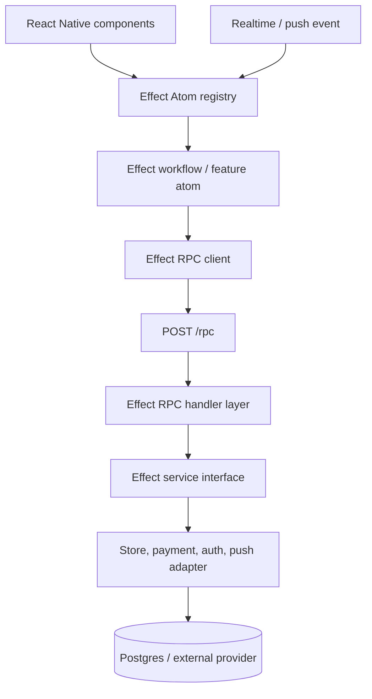

# Effect Mobile and RPC Architecture Specification

Status: adopted, migration in progress

Scope: `apps/customer-mobile`, `apps/staff-mobile`, `packages/domain`,
`packages/client`, and `apps/api`.

## 1. Decision

Altyn Market uses **Effect v4** for application workflows and services,
**Effect Atom** for mobile observable state, and **Effect RPC** for the typed
application API.

We do not add Redux, Zustand, React Query, a second server cache, or a
navigation framework. The apps currently compose screens at their root and
continue to do so. This is intentional: state, transport and lifecycle are the
first migration priority; navigation can remain a focused UI concern.

The local Effect source is the only API authority:

- `repos/effect-smol/LLMS.md`
- `repos/effect-smol/.patterns/effect.md`
- `repos/effect-smol/.patterns/testing.md`
- `repos/effect-smol/packages/effect/src/unstable/reactivity/**`
- `repos/effect-smol/packages/effect/src/unstable/rpc/**`
- `repos/effect-smol/packages/atom/react/**`

The older path `repos/effect-smol/unstable/atom` from the imported template is
not present in this checkout. `packages/atom/react` and
`packages/effect/src/unstable/reactivity` are the canonical Atom reference for
this repository version (`4.0.0-beta.90`). `repos/` is read-only and is never a
runtime import source.

## 2. Architecture



### Responsibilities

| Boundary | Owns | Must not own |
| --- | --- | --- |
| `packages/domain` | Schemas, tagged errors, value objects, pure rules, shared RPC definitions | React Native, Node, database, network implementations |
| Effect service | A capability interface: API, session, persistence, telemetry, clock, native API | JSX or vendor calls at a feature call site |
| Layer | Live/test implementations and service composition | Per-render construction |
| Effect Atom | Shared, derived, durable, asynchronous, and cross-component state | A giant mutable application object |
| Component | Rendering, accessibility, purely private presentation state, forwarding intent | Fetching, storage, business rules, SDK construction |
| Native adapter | SecureStore, AppState, connectivity, notifications, device APIs | Business workflow decisions |

Build the mobile runtime and `RegistryProvider` once at each app root. Build the
server Layer once at process startup. No screen or handler creates a new
runtime, registry, client graph, socket, or provider.

## 3. State rules

### 3.1 Atom ownership

- Define atoms outside render functions and group them by feature.
- Use `Atom.make` for writable feature state and derived atoms for computed
  values. Never synchronize a derived value into a second writable atom.
- Model request state with `AsyncResult`; render its `_tag` exhaustively.
  Initial, waiting, success and failure are meaningful data, never four loose
  booleans.
- Use `Atom.family` only with a stable entity identifier; never with an object
  created during render.
- Keep the default registry disposal behaviour. `Atom.keepAlive` requires a
  documented reason and owner.
- Components use `useAtomValue` to read, `useAtomSet` to dispatch, and
  `useAtom` only when they genuinely need both. Subscribe at the lowest useful
  component.
- `useState`/`useReducer` remain valid for an input focus, temporarily expanded
  card, or unsaved visual detail with no business meaning. Session, backend
  availability, cart, orders, queues, forms with workflow, and any async state
  belong in atoms.

The first migration moves customer/staff session and backend state through the
root Effect Atom registry. Subsequent phases move feature data and actions;
there must be no long-lived duplicate between `useState` and an atom.

### 3.2 Atom effect pattern

An atom invokes a feature service through its application runtime and exposes
the resulting `AsyncResult`. Refresh and invalidation use documented Atom
operations. Components do not fetch in `useEffect`.

`useEffect` is reserved for the narrow React Native integration boundary, such
as mounting an AppState, notification or connectivity subscription. The
subscription is translated to an Effect/Atom operation and always cleaned up.

## 4. Schema-first Effect RPC

`packages/domain/src/rpc.ts` is the API source of truth. It contains:

- Effect `Schema` DTOs and tagged RPC errors;
- `AltynMarketRpcs`, a shared `RpcGroup`;
- `RpcAuthentication` middleware and `RpcSession` capability.

The first compatible transport is `POST /rpc` with JSON serialization. It
contains typed `Health`, catalog and authentication calls. The current REST/SSE
routes stay alive during migration so deployed apps do not break. New mobile
feature work uses RPC; a REST route is removed only after its RPC replacement,
client migration, tests and staged deployment complete.

### RPC rules

1. Each request and response has an Effect `Schema`. TypeScript interfaces by
   themselves are not a wire contract.
2. Expected failures are tagged `Schema.ErrorClass` values. Defects are not a
   user-facing error protocol.
3. Auth belongs to `RpcAuthentication`; individual handlers receive
   `RpcSession` rather than parsing bearer headers themselves.
4. Client auth middleware reads the current session token through a service,
   adds the bearer header and has no knowledge of a screen.
5. Every write RPC includes an idempotency key in its schema and server
   implementation before it can be retried or queued.
6. RPC handlers return Effect values. The temporary adapter that lifts existing
   Promise-based backend services is a migration boundary, not the final server
   design.
7. HTTP RPC is used for commands/queries. A future RPC WebSocket/stream is for
   typed realtime only; database reads and commands remain authoritative.

## 5. Backend target

The backend remains a modular monolith. The modules do not change: auth,
catalog, cart, orders, picking, delivery, payments, notifications, admin and
metrics.

For each module, the target is:

```text
domain schema + tagged errors
        -> RPC definition
        -> Effect service interface
        -> live Layer (Postgres/provider adapters)
        -> RPC handler Layer
        -> RPC client/feature atom
```

`apps/api/src/effect-rpc.ts` is the bridge introduced first. It exposes the
shared group from the existing Node server at `/rpc`; it has a typed auth
middleware and an integration test that executes the actual HTTP RPC transport.

Migration of a module is complete only when:

- its RPC schemas replace the mobile-facing REST contract;
- its live implementation uses a service/layer rather than a raw imported
  singleton;
- provider/database Promise failures are decoded into tagged errors with their
  original cause retained;
- server test Layers replace payment, store, clock and external notification
  services deterministically;
- no legacy route/client is used by a supported app release.

### Persistence and time

- Effect services wrap Postgres, SecureStore, notification provider and device
  APIs. Components do not call them directly.
- Decode all storage, deep-link, native callback and HTTP boundary data through
  `Schema`.
- Credentials are only in the secure-storage adapter, never in ordinary atoms,
  telemetry, URL parameters, logs or a persisted RPC cache.
- Use Effect `Clock` and `DateTime` in Effect workflows. Test time with
  `TestClock`; do not call `Date.now()` inside a workflow.
- Use `Effect.acquireRelease`, scopes or scoped Layers for connections,
  subscriptions and background tasks. Resource cleanup is part of the
  implementation, not a convention.

## 6. Mobile runtime and native adapters

Each app gets one composition root with:

- `RegistryProvider` from `@effect/atom-react`;
- a managed application runtime containing the RPC client, token service,
  persistence service, clock, telemetry and native adapters;
- app-specific configuration and a no-op/test Layer for every external API.

The RPC client is built from `FetchHttpClient`, RPC serialization and the shared
auth middleware. React Native's compatible `fetch` is the transport; it is not
called from screens.

### App lifecycle

- AppState, connectivity, notification and push-token listeners are acquired
  once through adapters and released on scope close.
- Foreground or realtime events refresh/invalidate the relevant async atom.
  There is no screen-owned raw `setInterval` loop.
- A realtime event is only an invalidation signal. It never overwrites canonical
  order/cart state from a partial payload.
- Realtime authentication uses a short-lived ticket, not a bearer token in a
  URL. Reconnect uses a scoped exponential schedule with jitter and stops in
  background/logout.

### Push, analytics and errors

Push, analytics and error reporting are Effect services with no-op test Layers.
Screens emit typed user intent; the service decides how to deliver it.

- Push registration happens after an explained permission request, on login and
  token rotation. A notification tap contains only a typed destination/entity
  ID, then fetches canonical data.
- The backend writes notification intent to a transactional outbox with the
  business mutation. A worker sends, stores receipt/ticket status and handles
  invalid tokens.
- Analytics has a versioned event registry. It never contains access tokens,
  OTP, phone, address/comment or payment credentials.
- Error reporting scrubs sensitive data and includes app version, release,
  request ID and feature flags.

## 7. UX, performance and memory

- Use `FlatList`/`SectionList`, cursor pagination and stable IDs for catalogs,
  orders and assignments. No unbounded business list is rendered in
  `ScrollView`.
- API read models prevent N+1: catalog returns product plus customer price;
  staff assignments include the order summary needed by the queue.
- Render functions are pure. Do not acquire sockets, timers, storage or
  subscriptions during render.
- Every native subscription and scoped Effect has a release path. Never hide a
  stale update behind an `isMounted` flag.
- Preserve safe areas, keyboard behaviour, accessibility role/label/hint and
  stable `testID` values for all important actions.
- Profile before adding `memo`, `useMemo` or a new list/image package; these are
  optimizations, not a data consistency strategy.

## 8. TDD and quality gates

Use `@effect/vitest` with `it.effect` and `assert` for Effect workflows. Use a
normal synchronous test only for pure code. Never call `Effect.runSync` in a
test. UI tests use the current React Native test setup; device E2E tests use a
small Maestro suite against a deterministic test backend.

| Layer | Required evidence |
| --- | --- |
| Domain | Money/status/invariant and schema tests |
| Service | Success, each tagged failure, retry/timeout with `TestClock` |
| RPC | Schema encode/decode, auth middleware, handler/client HTTP round trip |
| Atom | AsyncResult states, refresh/invalidation and scoped cleanup |
| UI | Loading, empty, failure, success and accessible user intent |
| E2E | Customer sign-in/catalog/cart/checkout and staff queue/action flows |

Definition of Done:

1. A focused failing test exists first for a bug or critical acceptance path.
2. The feature has a schema, tagged error policy, owner Layer and atom owner.
3. UI handles all async states and never leaks sensitive data.
4. A command has idempotency and conflict behaviour before retry/offline work.
5. Focused tests, typecheck, lint and format pass; affected E2E flows pass
   before release.

## 9. Migration phases

### Phase 1 — foundation (in progress)

- [x] Pin Effect v4, `@effect/atom-react` and Node Effect adapter to the local
      reference version.
- [x] Put one `RegistryProvider` at each mobile root.
- [x] Migrate customer/staff session and backend state into stable atoms.
- [x] Create shared RPC schemas and a `/rpc` JSON transport.
- [x] Add Effect RPC auth middleware and typed client Layer.
- [x] Add a real in-process HTTP RPC contract test.

### Phase 2 — identity and public catalog

- [ ] Replace mobile auth client calls with RPC services/atoms and a secure
      token storage Layer.
- [ ] Move catalog/category reads to `AsyncResult` atoms using `ListCatalog`.
- [ ] Remove per-product price fetch from the mobile client.
- [ ] Replace legacy REST calls only after preview validation.

### Phase 3 — customer flow

- [ ] Migrate cart, checkout, order list/detail and payment return flow.
- [ ] Add idempotency store/schema to checkout and all commands.
- [ ] Add real push outbox and typed notification-deep-link atom action.

### Phase 4 — staff flow and realtime

- [ ] Migrate assignment, picking and delivery RPCs with role middleware.
- [ ] Deliver queue read models, command conflict errors and typed realtime
      invalidation stream.
- [ ] Remove focused-screen fallback polling only when realtime observability
      proves stable.

### Phase 5 — remove compatibility code

- [ ] Remove migrated REST endpoints, bespoke client fetch methods and screen
      data effects.
- [ ] Complete Effect service/Layers around Postgres and providers.
- [ ] Enable required CI, nightly E2E and staged release monitoring.

## 10. Non-negotiable rules

- Do not guess Effect v4 APIs; read the local reference first.
- Do not import from `repos/` at runtime.
- Do not create a runtime/registry in a component or a request handler.
- Do not run Effect work during render or use direct SDK calls in JSX.
- Do not keep server/async state in a second UI store.
- Do not put a long-lived bearer token in a URL, normal storage, logs,
  analytics or persisted atom.
- Do not use `try/catch` inside `Effect.gen`; use typed Effect error handling.
- Do not run `Effect.runSync`/`runPromise` throughout feature code; cross the
  imperative boundary once through the application runtime or documented Atom
  integration.
- Do not remove a REST path until the RPC replacement is deployed, exercised
  and observable.
